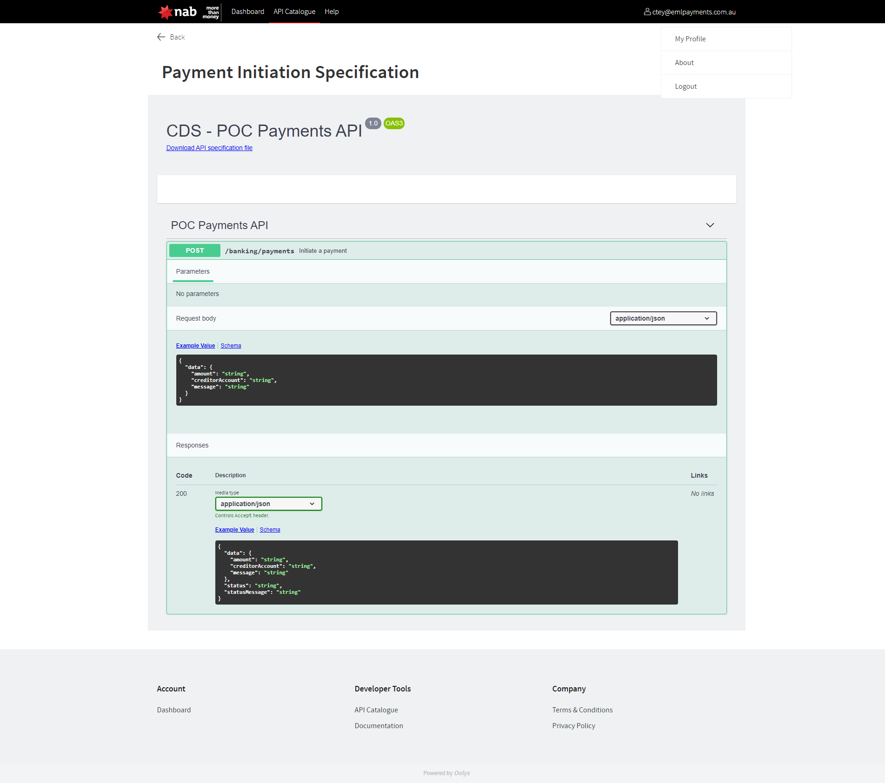

# Open Banking Sandbox

## Developer facing - API docs and configuration
 
 

### Postman collection
The postman collection is well organised. see [postman_collection.json](./nab.postman_collection.json)
and comes with an Environment file that is pre-generated with correct values for each sandbox [better-grip-generic-full_v1-0-0_postman_environment.json](./better-grip-generic-full_v1-0-0_postman_environment.json)

 
 
 
 
 

 
 
 
 
 
 
 

## Customer facing - Web Banking

 
 
 

