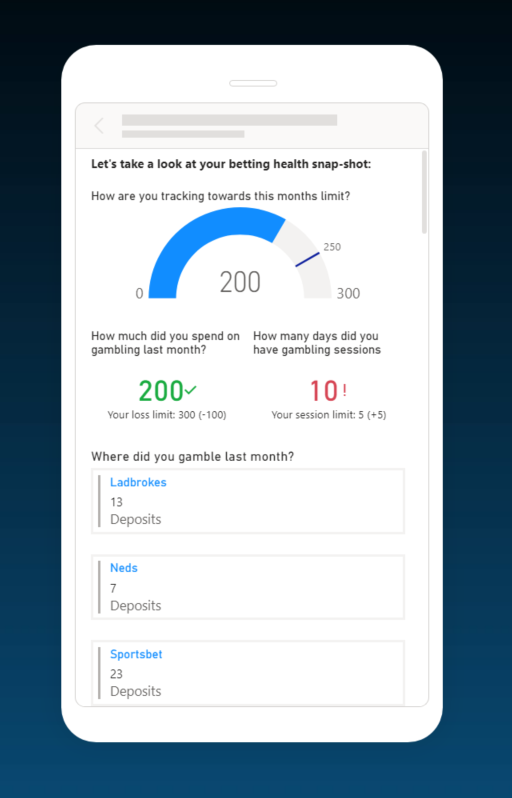
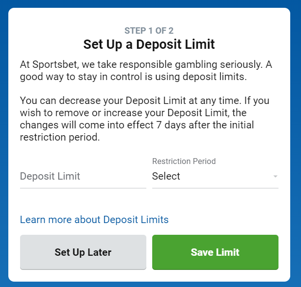

# Better Grip - Hackathon - Open Banking

## Background

Today, gambling apps are so easily accessed. Can we help a gambler work out
how much money they have been spending using Open Banking APIs? 

Further, can we help gamblers set limits on how much they spend?

## Pitch

We aim to utilise Open Banking to monitor the user's behaviour on gambling/sport betting related sites/apps and overall financial wellbeing. 

## Key Features:  

- Trend and projection - historical and future projection of gambling spend and personal financial wellness  
- Display future impact calculator  
- Display the impact of gambling on their credit/borrowing risk profile  
- Support information – link the problem gambler to support services  
- Opt-out of gaming advertising and notifications across platforms with notification to all operators  
- Data to assist gaming companies and regulators to monitor the personal and financial well-being of problem gamblers 

## Who is the team behind this

From left: Angus Quail, Caitlin Taylor, Stephanie Chadwick,
Chui Tey, Callum Reynolds, Murray Thorpe
(Not in picture - Rance Wu)

## Pitch presentations

[Video - Pitch](@docs/PingPongPayPitch.mp4)
[Video - Demo](@docs/PingPongPayDemo.mp4)

<video width="300">
    <source src="@docs/PingPongPayPitch.mp4" />
</video>
<video width="300" title="Demo">
    <source src="@docs/PingPongPayDemo.mp4" />
</video>

<a href="@docs/Pitch Presentation - Final .pdf">Presentation (PDF)</a>

## Actual Screenshots

TODO

## Wireframes

## Other Resources

<a href="@docs/PingPongPayArchitectureDiagramBetterBet.pdf">Architecture (PDF)</a>

## Open Banking Sandbox

[Open Banking Sandbox screenshots](@docs/openbanking/sandbox.md)
## Source Code

See [Development notes](DEVELOPMENT.md)

## TODO

- Actual product screenshots

- Product intelligence
